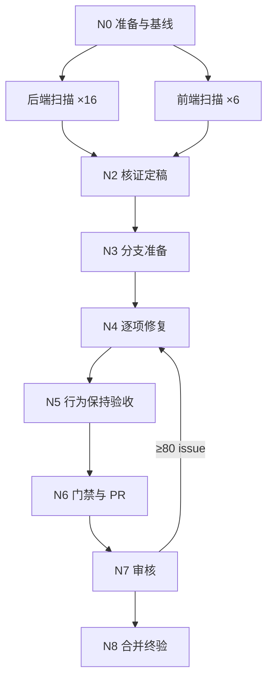

# 全仓风险与宪法偏离扫描 · 交付graph执行设计

> 本文档为唯一执行依据，执行者按节点依赖（N0→N8）顺序推进；**全任务仅在「第五章 DoD」全部满足后才允许退出主循环**。凡需用户决策的事项（升级用户、停手待裁决、L3 汇总）一律经内部澄清工具 ask_question 阻塞等待用户选择，**即使用户长时间未响应也必须一直等待**，禁止以任何理由中断执行，拿到决策后完整续跑。
> 根定位层 `AGENTS.md`、子宪法 `backend/AGENTS.md` 与 `web/AGENTS.md`、全局规范 `~/.zcode/AGENTS.md` 为本任务最高约束，任何产出与之冲突即判定不合格。

## 0. 执行框架总览

### 0.1 目标

对全仓前后端代码（N0 实取 dev HEAD 基线）做 22 路专项扫描，**宪法偏离 4 轨为用户着重要求、第一优先**（对象转换 MapStruct 纪律 / MyBatis-Plus 持久层纪律 / 宪法全条款对照 / 可读性与循环内查询），另含风险（A 类）、性能（B 类）、质量（Q 类）；每职责一个专职 subagent，产出两份带证据与置信度的报告；核证 ≥80 项逐项修复（业务保持优先、零破坏性变更），经行为保持验收与 PR 审核后合入 dev。

### 0.2 主控循环（Master Graph）

```text
初始化进度文件（N0）
N1 二十二路专项并行扫描（后端 16 + 前端 6，互不依赖，同时发出；宪法偏离 4 轨优先核）
N2 汇合：跨片去重 → 核证打分 → 定稿报告与修复清单
N3 worktree 修复分支准备（基于 N3 时点 dev HEAD）
N4 逐项修复（串行，一问题一提交，内含修复循环；禁改既有测试断言）
N5 行为保持验收（覆盖矩阵 100% 覆盖修复项）
N6 全量门禁 → push → PR → CI
N7 code-review 插件审核（不通过回 N4，见第六章）
N8 合并 → 删分支与 worktree → 终验：DoD 逐项勾选附证据 + 修宪建议候选呈报
→ DoD 全满足退出；未满足回退责任节点；全程未通过走回退边或节点内修复循环，超限升级用户
```



**并行分支**：N1 二十二路互不依赖同时发出；N2 汇合要求二十二片全到。**回退边**：N5 失败 → N4；N7 ≥80 issue → N4 后重走 N5~N7。

### 0.3 阶段门禁总表

| 节点 | 名称 | 核心产物（路径） | 出口门禁 |
| --- | --- | --- | --- |
| N0 | 准备与基线 | 进度文件 `docs/progress/2026-09-28-全仓风险扫描-progress.md` | 基线钉死；排除清单落盘 |
| N1 | 专项扫描 | 分片 ×22（`docs/bugs\|pref/`，本地留存） | 扫描项逐条有记录；候选要素齐备 |
| N2 | 核证定稿 | bugs 高风险清单 + pref 优化清单 | 每候选独立评分；≥80 附方案与影响面 |
| N3 | 分支准备 | worktree + `fix/risk-scan-2026-09-28` | 基于 dev HEAD；编译与装依赖通过 |
| N4 | 逐项修复 | 修复提交 ×N | 清单 100%；一问题一提交含测试 |
| N5 | 行为保持验收 | `docs/progress/2026-09-28-全仓风险扫描-验收.md` | 矩阵 100%；全场景通过 |
| N6 | 门禁与 PR | PR → dev | 双端门禁绿；CI 各 job 绿 |
| N7 | PR 审核 | 审核评论（PR） | 无 ≥80 issue；CI 绿 |
| N8 | 合并终验 | `docs/progress/2026-09-28-全仓风险扫描-终验.md` | 已合并；清理完成；DoD 全勾 |

※ 入库约定：进度 / 验收 / 终验提交 git；bugs/pref 报告与分片被 `.gitignore` 排除、本地留存，禁 `git add -f`。

---

## 1. 任务范围定义

### 1.1 范围内（In Scope）

1. 全仓扫描（范围与排除见 N0）：宪法偏离 4 轨、A 类风险、B 类性能、Q 类质量，前后端 22 专项，扫描项见 N1。
2. 两份报告落盘，每项附证据、0-100 置信度与状态；核证按 code-review 插件 rubric 独立打分（核证 ≠ 扫描专员）。
3. ≥80 项逐项修复：单 fix 分支、一问题一提交、测试同提交、业务保持优先。
4. 行为保持验收矩阵 100% 且全通过（审核前置门禁）；PR 审核通过后合并删分支。

### 1.2 范围外（Out of Scope）

1. N0 排除项：未提交文件（`.zcodeignore`、`docs/progress/2026-09-25-P2立项与SDD执行交接.md`）与非代码目录（`docs/`、`deploy/`、`.github/`、`scripts/` 等）。
2. 模糊与语义争议项：入「待裁决」呈报，不动代码。
3. 宪法文档修订（修宪建议仅呈报，见 N8）；新功能与大规模重构（质量修复限行为保持的最小变更）与破坏性变更（API 契约 / openapi 生成物 / DB schema / 公共组件契约）。
4. 依赖升级与既有测试断言改动（回归红线出口另走专项 PR，见红线 10）。

### 1.3 任务划分与拆分依据（需求模式）

- 粒度 =「端组 × 职责专项」：前后端分别审查，每职责一个专职 subagent 按本职责判据过筛；专项落地为确定扫描项清单（N1），禁泛化扫描。
- 宪法偏离 4 轨（BE-C1/C2/C3/C4）为用户着重第一优先，判据锚定子宪法条款编号；种子候选（N1）先行核证。
- 核证独立于扫描（禁自我审核）；修复共用单分支故串行；验收与审核为合入前置；Q 类专项由 code-simplifier 子代理承担（只读，覆盖其默认改码行为）。

---

## 2. 全局执行总则

1. **阶段门禁制**：未满足出口门禁禁止进入下一节点；回退记录进进度文件。
2. **决策链**：L1 项目内部（源码、宪法、测试、git 历史）→ L2 外部 → L3 用户一次性汇总，不得跳级。
3. **循环收敛**：修复循环设最大迭代，超限升级用户，禁静默放弃。
4. **单一事实源**：本文档与 N2 定稿报告为修复唯一依据；报告缺陷先回改再修。
5. **状态续传与可验证完成**：每过一个门禁更新进度文件（含派遣日志）；完成声明附证据。
6. **subagent 执行制**：扫描、修复、核证与审核一律派遣，主控仅编排。
7. **业务保持优先（用户硬约束）**：修复不得破坏既有业务功能；N0~N2 对仓库零写入（仅报告分片落盘与 `.gitignore` 补两行例外），禁触碰主工作区并行改动；提交信息遵守 Conventional Commits 且 body 每行 ≤100 字符（commitlint 雷区）。

---

## 3. 阶段详细定义

### N0 准备与基线

**依赖**：无

**步骤**：

1. `git rev-parse HEAD` 实取扫描基线（当前 dev HEAD = 46aeeba）→ 验证：hash 入进度文件。
2. 排除清单与快照：`git status --porcelain` 未提交文件整文件排除（登记待补扫）+ 非代码目录 → 验证：落盘。
3. 创建 `docs/bugs/`、`docs/pref/` 目录，`.gitignore` 追加 `docs/bugs/`、`docs/pref/` 两行 → 验证：`git check-ignore` 生效且原条目零改动。
4. 创建进度文件（派遣日志、决策日志、门禁状态、修复状态表、验收矩阵五节）→ 验证：五节齐备。

**产物**：进度文件（0.3 路径）　**出口门禁**：基线钉死；清单与快照落盘；五节齐备

### N1 二十二路专项并行扫描

**依赖**：N0（并行起点）　**输入**：基线 hash、排除清单；候选 ID = `<端组>-<专项>-<序号>`（如 BE-C2-01）

**确定扫描项清单**（判据 = 对应端子宪法 + 根 `AGENTS.md` §7 + 全局 §一注释 / §二日志 / §四测试与死代码；后端范围 = `backend/` 全部 Maven 模块 src/main 与 src/test，前端范围 = `web/apps/` 三应用 src）：

| 专项 | 确定扫描项 |
| --- | --- |
| BE-C1 对象转换纪律★ | A.7-3/A.7-4/B.1：手动 setter 逐字段转换未走 MapStruct；Entity 直接出 API 层；convert/ 缺 XxxConverter；金额、医嘱状态等关键业务字段映射无手写核对或单测覆盖 |
| BE-C2 持久层纪律★ | A.4.3-12~21：IService/ServiceImpl 继承配对（接口 I 前缀、实现 Impl 后缀落 service/impl/，聚合/报表型例外逐个甄别）；直注 mapper 绕过 ServiceImpl 内置链式能力；跨 service 直操他人 mapper；查询缺分页（maxLimit=2000）；@TableLogic/@Version 缺失；三大插件集中注册 |
| BE-C3 宪法全条款对照 | backend 宪法 A/B 组全部强制条款逐条过筛：A.1 编码（裸 System.out、全限定类名、异常口径）、A.1-8/A.4.2-7 事务（controller 禁 @Transactional、事务内禁远程调用）、A.3 错误码、B.1/B.2 分层（controller 禁业务逻辑与直注 mapper、禁依赖他人 impl）+ 根 §7 编码/版本/安全红线（敏感字段加密落库、审计日志） |
| BE-C4 可读性与循环内查询★ | 增强 for 冒号右侧内嵌方法调用（含 mapper/service 查询；判据 = 用户指令，宪法暂无显式条款）；A.4.3-14 循环内单查改 in 批量（N+1）；A.4.3-13 按需取列；A.1-15 手写样板 |
| BE-A1 运行错误 | 吞异常、空值未判、越界；循环内阻塞；状态机非法迁移；时区与金额单位（分/元）口径；响应模型不符 |
| BE-A2 数据丢失与事务 | 无事务 / 无回滚；整行覆盖丢字段、并发丢更新；级联删除副作用；软删漏过滤 |
| BE-A3 权限与敏感数据 | IDOR 缺归属校验；未鉴权端点；响应泄露身份证/手机号等敏感字段（对照加密落库要求）；日志含敏感信息 |
| BE-A4 注释日志死代码 | 缺业务注释与关键行注；写操作无日志；死代码残留；失效测试 |
| BE-A5 资源泄漏 | DB 会话与流未关；MinIO 客户端与流未清理；线程池 / 异步任务未回收；WS/SSE 未关 |
| BE-B1 DB 查询 | N+1；COUNT 与列表双查询；缺索引；全行投影与全量拉取；深分页 OFFSET |
| BE-B2 缓存 | 热点无缓存（Redis：号源 / 床位 / 字典 / 大屏快照）；每项附一致性维护方案（失效 / TTL / 写后失效） |
| BE-B3 异步与阻塞 | 循环内 CPU 密集与阻塞 IO；串行可并行；长耗时应入 MQ（TTL+DLX 延迟场景） |
| BE-B4 文件与外部 IO | MinIO 全量读入内存、未并发、缺超时；大文件无流式 |
| BE-B5 原子化 | 检查-后-行动竞态；号源 / 床位扣减无条件 UPDATE；状态流转无 CAS；Redis 多步可 Lua |
| BE-B6 算法复杂度 | 嵌套循环内线性查找可索引降幂（O(n²)→O(n)）；循环内重复计算 / 排序；多趟遍历可单趟合并 |
| BE-Q1 代码质量 | code-simplifier 只读：重复逻辑、深嵌套、命名不符、冗余死抽象；只提行为保持建议 |
| FE-A1 运行错误与泄漏 | 未捕获 rejection；竞态与卸载后 setState；空值链；index key 错乱；监听器 / 定时器 / Observer / WS 未清理 |
| FE-A2 数据丢失 | 表单编辑态切换丢失；乐观更新不回滚；并发写覆盖；删除无确认 |
| FE-A3 权限与安全 | 仅前端守卫；token 落日志；VITE_ 承载密钥；错误渲染内部细节；路由权限点缺漏 |
| FE-A4 宪法偏离 | web 宪法全条款对照：A.1-1 script setup、A.1-4 禁 any、A.2-2 VITE_ 公开、A.3-3 契约生成物新鲜度、A.3-6 Long 用 string / 金额不前端计算、B.2-1 依赖单向、B.2-6 业务逻辑入 composables、B.3-2 路由懒加载 |
| FE-B1 网络与渲染 | 并发去重缺失、重复拉取；串行可并行；该分页却全量；轮询无退避；大列表无虚拟化、大计算无 memo |
| FE-Q1 代码质量 | 同 BE-Q1 口径，范围 web/apps 三应用 |

**已核证种子候选**（2026-09-28 只读探查实证，直接随对应专项分片入 N2 核证；扫描专员仍须全量过筛，种子不替代扫描）：

- BE-C1：16 个业务模块 convert/ 无转换器；手动 setter 转换如 `AppointmentServiceImpl.java:322-328`（同文件 22 处）、`DispenseServiceImpl.java:249`、`ScheduleServiceImpl.java:202`。
- BE-C2：`extends IService` 25 处与 `extends ServiceImpl` 42 处不配对、≥8 个接口未继承；`IAlarmService.java:17` 未继承且 `AlarmServiceImpl.java:39` 直注 mapper；fuyun-inpatient / fuyun-billing 多个实现待甄别聚合例外（A.4.3-20）。
- BE-C4：for 冒号右侧内嵌查询 9 处：`DashboardServiceImpl.java:377`、`AlarmEngine.java:402/828/846`、`MergeRecordServiceImpl.java:201`、`TelemetryIngestServiceImpl.java:183`、`QualityServiceImpl.java:286/354/359`。

**步骤**（每专项同构）：1. `git ls-files` 按排除清单过滤得扫描清单 → 验证：覆盖全部入扫文件；2. 逐文件对照本专项扫描项过筛（只查本职责）→ 验证：逐条有检查记录；3. 候选写入分片（ID / 严重级 / 文件：行 / 片段 / 触发条件与影响）→ 验证：要素缺一不收。

**产物**：二十二份分片（0.3 路径，N2 后删除）　**出口门禁**：二十二专项分片齐、扫描项逐条有记录；候选要素齐备

### N2 核证打分与定稿

**依赖**：N1（汇合点，二十二片全到）　**输入**：二十二份分片；code-review 插件原文（第八章，派遣前必读）

**步骤**：

1. 主控跨片去重（宪法轨与 Q / B1 重叠项归并）→ 验证：记录入进度文件。
2. 并行派遣核证专员（按端组分片，禁与对应扫描专员同人）：按插件原文 rubric 打 0-100 分并按其假阳性清单核验；只读自查独立取证 → 验证：每候选一项结论。
3. 证据无法核实者不回流重扫，按 rubric 低分定级入「低置信观察」节。
4. 定稿两份报告：≥80 进修复清单（附方案与影响面）；50~79 入低置信观察；<50 剔除；语义争议入「待裁决」→ 验证：分级齐全；删除二十二份分片。

**产物**：`docs/bugs/2026-09-28-全仓高风险问题清单.md`、`docs/pref/2026-09-28-全仓性能与代码质量优化清单.md`　**出口门禁**：每候选独立评分；报告分级齐全；分片已清理

### N3 修复分支准备

**依赖**：N2

**步骤**：

1. `git worktree add .worktrees/fix-risk-scan-2026-09-28 -b fix/risk-scan-2026-09-28 <N3 时点 dev HEAD>`（dev 已前移不回迁，冲突留 PR 阶段，禁对主工作区 rebase）。
2. worktree 内验证：backend `mvn -B -ntp -DskipTests compile` 通过；web `pnpm install --frozen-lockfile` 通过。
3. 主工作区 `git status --porcelain` 与 N0 快照比对 → 验证：逐字一致，不一致停手升级。

**产物**：worktree + fix 分支　**出口门禁**：分支基于实取 dev HEAD；编译与装依赖通过；快照一致

### N4 逐项修复

**依赖**：N3　**输入**：修复清单（BUG-xx / OPT-xx）

**步骤**（串行逐项，禁并行专员共享 worktree）：

1. 修复前业务设计核验：对照 `docs/specs/` 与宪法确认语义一致；语义争议或破坏性风险转待裁决。
2. 逐项派遣实现专员（六要素见第四章）：RED → GREEN → 行为保持对照；触及局部门禁（backend：Spotless check + 受影响模块测试；web：lint + type-check + 受影响应用 test 切片）；一问题一提交（提交信息含 ID / 根因 / 修复 / 验证，body 每行 ≤100 字符）。
3. 每项完成即更新进度状态表（ID ↔ commit hash）；方案缺陷回 N2 修订后再修，清单外发现只登记不顺手修。

**产物**：修复提交 ×N　**出口门禁**：清单 100%；一问题一提交含测试；既有测试断言零改动；零破坏性变更

### N5 行为保持验收

**依赖**：N4

**步骤**：

1. 建覆盖矩阵：修复项 ID → 验收场景（后端 = 受影响模块 failsafe IT / API 集成链路；前端 = playwright-cli 真机被改路径；优化项 = 行为不变对照）→ 验证：无孤项。
2. worktree 起全栈执行全部场景 → 验证：每场景有记录与断言；失败回 N4 重验（验收循环 ≤3）。

**产物**：验收记录（0.3 路径）　**出口门禁**：矩阵 100%；全场景通过且记录含证据　**回退边**：场景失败 → N4

### N6 分支全量门禁与 PR

**依赖**：N5

**步骤**：

1. worktree 全量门禁：backend `mvn -B -ntp verify`（Spotless palantir 格式 + 单测 + Testcontainers 集成测试 + JaCoCo BUNDLE LINE ≥0.80 / 核心包 ≥1.00）；web `pnpm lint / format:check / type-check / test / build` → 验证：输出附进度文件。
2. push → `gh pr create --base dev`（描述列修复项与影响面）→ 等 CI 各 job（backend / frontend / images / commitlint / hygiene）绿 → 验证：`gh pr checks` 全绿。

**产物**：PR（fix 分支 → dev）　**出口门禁**：双端门禁绿存档；PR 创建成功且 CI 绿

### N7 code-review 插件审核循环

**依赖**：N6　**输入**：PR；插件原文（派遣前必读，流程与打分以原文为准）

**步骤**：

1. 派遣审核专员按插件原文全流程执行（资格检查 → 约束文件映射三份宪法 → 摘要 → 多路并行独立审核 → rubric 打分 → 过滤 <80 → 复查 → PR 评论）→ 验证：评论可见。
2. 存在 ≥80 issue：回 N4 增量修复（同分支）→ 重走 N5~N6 → 重审（审核循环 ≤5）；审核专员独立于 N4 实现专员。

**产物**：PR 审核评论　**出口门禁**：无 ≥80 issue；CI 保持全绿

### N8 合并与终验

**依赖**：N7

**步骤**：

1. squash 合并 PR（沿用仓库 PR 惯例）→ 验证：`gh pr view` 为 MERGED；删 fix 分支与 worktree；确认 dev CI 绿；主工作区快照复验一致。
2. 终验报告：DoD 逐条证据 + 待裁决呈报 + 待补扫清单 + 低置信观察移交 + **修宪建议候选呈报**（BE-C4 判据「增强 for 冒号右侧内嵌调用」宪法暂无显式条款，建议新增编码规约条款；按根宪法 §6 本轮只呈报不修宪）；进度写终态。

**产物**：终验报告（0.3 路径）　**出口门禁**：已合并且清理完成；dev CI 绿；DoD 逐条附证据

---

## 4. 派遣规范（subagent 执行制）

扫描（调研）、修复（实现）、核证与 PR 审核（审核）一律派遣，主控不亲自执行；审核专员独立于实现专员，禁自我审核。角色与边界：专项扫描专员 ×22（端组 × 职责一一对应；BE-Q1 / FE-Q1 由 code-simplifier 子代理担任，派遣指令覆盖其默认改码行为为只读）；核证专员（按端组分片独立打分，不扫新候选不修复）；实现专员（单项修复 + 测试 + 局部门禁 + 提交，不改方案不顺手修）；审核专员（按插件原文全流程审核）。

每次派遣必须包含六要素：

```markdown
【角色】专项扫描专员 / 核证专员 / 实现专员 / 审核专员（明确单一职责）
【目标】一句话可验证目标（禁止「了解 / 梳理 / 协助完成」类泛化描述）
【输入】具体路径（基线 hash、排除清单、专项编号与扫描项、种子候选、插件原文路径等）
【职责】做什么、不做什么
【输出】产物路径 + 必含内容结构
【完成标准】可验证的退出条件
```

**并行规则**：N1 二十二专项与 N2 核证分片并行；N4 严格串行；N5 按端分组可并行；N7 内多路按原文并行——并行判定经冲突与依赖反思，存疑改串行。**code-review 插件**：N2 打分与 N7 审核以插件原文为唯一流程依据，相关派遣先读原文（第八章）。

---

## 5. 完成条件（Definition of Done · 退出唯一依据）

- [ ] 两份报告落盘且分级齐全，每项含证据 + 置信度 + 状态
- [ ] 宪法偏离 4 轨扫描完成，种子候选全部核证有结论（C1 覆盖面 / C2 继承配对 / C4 内嵌调用定位）
- [ ] ≥80 项修复 100% 完成，一问题一提交、测试同提交（状态表 ID↔hash + git log）
- [ ] 既有测试断言零改动（git diff 核查）；业务零破坏、零破坏性变更（验收对照 + N7 结论）
- [ ] 验收矩阵 100% 覆盖修复项且全通过（验收记录）
- [ ] 双端全量门禁绿、PR CI 各 job 绿（进度文件输出 + `gh pr checks`）
- [ ] code-review 审核通过无 ≥80 issue（PR 评论链接）
- [ ] PR 已合并 dev，fix 分支与 worktree 已删，dev CI 绿；主工作区并行改动零扰动（三次快照一致）
- [ ] 派遣日志完整、产物按 0.3 入库、待裁决 / 待补扫 / 修宪建议候选已呈报

---

## 6. 循环与中止机制汇总

| 循环 | 触发条件 | 动作 | 退出条件 | 最大迭代 | 超限处理 |
| --- | --- | --- | --- | --- | --- |
| 修复循环 | N4 单项测试 / 校验失败 | 定位 → 重修 → 复测 | 该项验收达成 | 3 | 升级用户（附问题清单与状态） |
| 验收循环 | N5 场景失败 | 回 N4 修复 → 重跑失败场景 | 矩阵全通过 | 3 | 升级用户（附失败场景与证据） |
| PR 审核循环 | N7 出现 ≥80 issue | N4 增量修复 → N5 补验 → N6 重推 → N7 重审 | 无 ≥80 且 CI 绿 | 5 | 升级用户（附审核原文与分歧） |
| 终验循环 | N8 DoD 未全满足 | 回责任节点修复 | DoD 全满足 | 3 | 升级用户 |

**中止条件**：合并仅在 N7 门禁满足后执行，禁先合再补；语义争议 / 破坏性 / 删数据等不可逆操作停手转待裁决或 L3 升级；快照不一致、worktree 异常无法恢复、集成测试端口被主工作区服务占用（禁擅杀非本任务进程）停手升级；上述待裁决 / 升级一律经 ask_question 阻塞等待，用户长时间未响应也一直等待、禁中断执行或替用户默认选项；静默放弃、伪造证据、跳过门禁并入第七章红线。

---

## 7. 红线禁止事项

1. N0~N2 绝对只读：禁改代码 / 配置 / 依赖，禁 checkout、切分支、stash、reset（主工作区存在未提交改动）；仅允许两类受控写入——报告与分片落盘、`.gitignore` 追加两行
2. 禁止无证据候选与报告：「文件:行 + 片段 + 影响」缺一不收，禁推测
3. 禁止修清单外问题；清单外发现只登记不顺手修
4. 禁止跳过节点门禁或裁剪门禁步骤；禁未经测试验证声明完成
5. 禁伪造、跳过、选择性运行测试 / CI / 验收场景
6. 禁止破坏性变更或改变业务语义（API 契约 / openapi 生成物 / DB schema / 公共组件契约）；语义争议转待裁决
7. 禁止现场偏离定稿方案；方案缺陷回 N2 修订后再修
8. 禁止自我审核：核证 ≠ 对应扫描专员，N7 审核 ≠ N4 实现专员
9. 修复仅限 N3 worktree，禁在主工作区提交；禁 `git add -f` 提交 gitignored 报告；禁擅杀非本任务进程；产物禁仅存对话
10. 禁止修改既有测试断言（根宪法 §7 回归红线出口：断言现代化须专项 PR 逐次批准并留痕，本轮一律停手转待裁决呈报）
11. 禁止在等待用户裁决 / 升级时以任何理由中断执行或超时自行继续，必须经 ask_question 阻塞等待直至用户决策

---

## 8. 用户输入与待调研项

- 用户观察偏离（原话要点）→ 落点：①对象转换未用 MapStruct 而直接 set 转换 → BE-C1；②MyBatis-Plus 约束未守（service 接口与实现类继承及其它约束）→ BE-C2；③增强 for 中直接写入 mapper 查询等可读性问题 → BE-C4
- 用户裁决（2026-09-28）→ 落点：扫描范围 = 全仓前后端（N1）；报告落 `docs/bugs` + `docs/pref` 本地留存、`.gitignore` 排除（N0）；扫描 + 修复 + PR 合入全流程（N3~N8）
- 参考：code-review 插件原文 `C:\Users\Lenovo\.zcode\cli\plugins\cache\claude-plugins-official\code-review\0.0.0\commands\code-review.md` → N2 rubric 与 N7 审核唯一依据
- 参考：code-simplifier 插件子代理 → BE-Q1 / FE-Q1 执行者（派遣只读、显式全仓）；根 `AGENTS.md` + `backend/AGENTS.md` + `web/AGENTS.md` + 全局 `~/.zcode/AGENTS.md` → 扫描判据与门禁依据
- 待调研项：无
